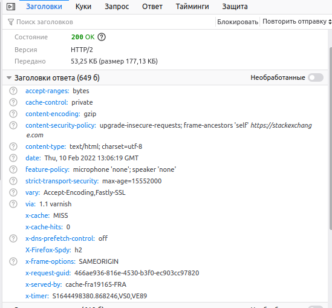
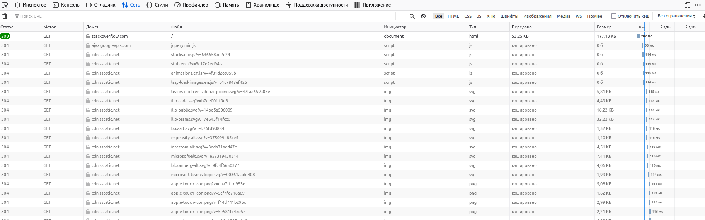
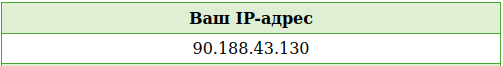
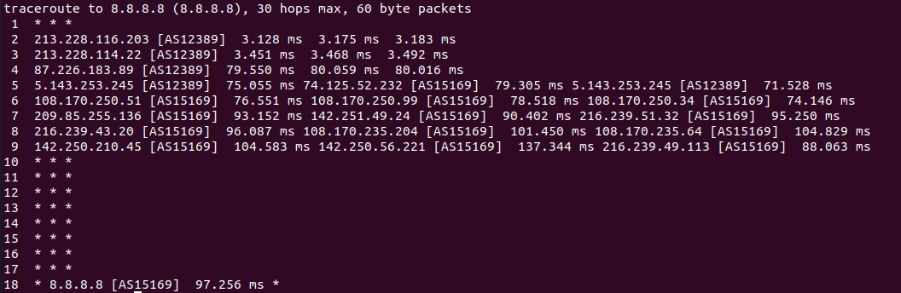
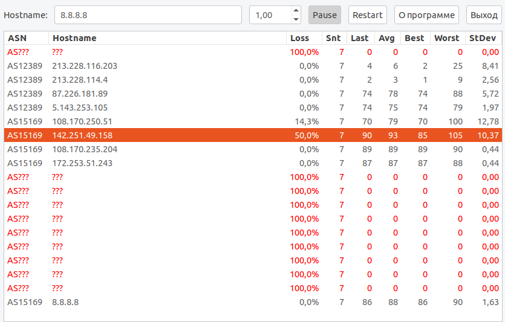

# devops-netology_3.6
1. 
  
HTTP 301 - запрошенный ресурс был перемещён в новое месторасположение (https://stackoverflow.com/questions
)   

2. 

Status Code: 200  (scheme:	https; host: stackoverflow.com)  

  
Главная страница за 202мс  

3. 
  

4. whois 90.188.43.130
  
AS39054  

5. traceroute 8.8.8.8 
  
213.228.116.203 [AS12389]  
213.228.114.22 [AS12389]  
87.226.183.89 [AS12389]  
5.143.253.245 [AS12389]  74.125.52.232 [AS15169]  5.143.253.245 [AS12389]  
108.170.250.51 [AS15169]  108.170.250.99 [AS15169]  108.170.250.34 [AS15169]  
209.85.255.136 [AS15169]  142.251.49.24 [AS15169]  216.239.51.32 [AS15169]  
216.239.43.20 [AS15169]  108.170.235.204 [AS15169]  108.170.235.64 [AS15169]  
142.250.210.45 [AS15169]  142.250.56.221 [AS15169]  216.239.49.113 [AS15169]  
8.8.8.8 [AS15169]  

6. 
  
Наибольшее время задержки (Worst - 105mc): AS15169 142.251.49.158  

7. dig dns.google.com  
dns.google.com.		564	IN	A	8.8.8.8  
dns.google.com.		564	IN	A	8.8.4.4  

9. dig -x 8.8.8.8  
8.8.8.8.in-addr.arpa.	2765	IN	PTR	dns.google.  
4.4.8.8.in-addr.arpa.	71664	IN	PTR	dns.google.  
dns.google

